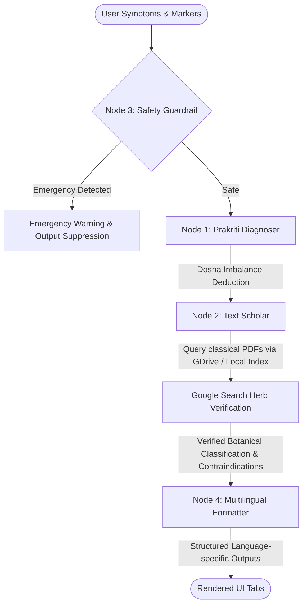

# 🪔 Samatva Ayurvedic Health Assistant

🍃 **Bharat Ayurvedic Health Remedies** is a clinical reasoning system mapping modern symptoms to classical Ayurvedic Samhitas (Charaka-Samhita and Sushruta-Samhita). Built using a multi-agent council powered by the **Google Antigravity Agent SDK (ADK)** and the **Gemini 3.5 / 2.5** family of models, it provides personalized, Samhita-grounded dietary, lifestyle, and home remedy guidelines.

---

## 📜 Table of Contents
1. [Key Features](#-key-features)
2. [Multi-Agent Council Architecture](#-multi-agent-council-architecture)
3. [STRIDE Security & Safety Model](#-stride-security--safety-model)
4. [Tech Stack](#-tech-stack)
5. [Getting Started & Installation](#-getting-started--installation)
6. [Configuration](#-configuration)
7. [Running the Application](#-running-the-application)
8. [File Structure](#-file-structure)

---

## 🌟 Key Features

*   🌿 **Prakriti Consultant**: Deduces primary dosha imbalances (Vata, Pitta, or Kapha) based on user symptoms and physical markers (sleep, digestion, skin, age, stress levels).
*   📚 **Samhita Grounded**: Resolves clinical queries using Charaka-Samhita (for internal medicine/Kayachikitsa) and Sushruta-Samhita (for external remedies/wound healing/Shalyachikitsa).
*   🌐 **Multilingual Remedies**: Translates formatted remedy packages into multiple languages, including **English [EN]**, **हिन्दी [HI]**, **తెలుగు [TE]**, and **ಕನ್ನಡ [KA]**.
*   📰 **Practitioner Feed**: Streamlines seasonal routines (Ritucharya), CCRAS clinical trials, and Ministry of AYUSH publications.
*   🎨 **Premium Neumorphic UI**: Uses custom 3D and Neumorphic aesthetics for an intuitive and responsive practitioner experience.

---

## 🤖 Multi-Agent Council Architecture

The application utilizes a coordinated 4-node agent system built on `google-adk` to automate clinical reasoning:



1.  **Node 1: Prakriti Diagnoser**: Matches user physical baseline markers and symptoms to deduce primary Vata, Pitta, or Kapha imbalances.
2.  **Node 2: Text Scholar Integration**: Connects to a Google Drive repository containing scanned Ayurvedic Samhitas to cross-reference historical remedies. It also leverages Google Search to verify botanical names and identify modern precautions for Sanskrit herbs.
3.  **Node 3: Safety Guardrail**: Runs first to inspect inputs for high-risk symptoms (e.g., severe chest pain, shortness of breath, sudden paralysis). If triggered, it instantly halts the pipeline, suppresses output, and displays an emergency medical redirect.
4.  **Node 4: Multilingual Translation & Formatter**: Formats the final treatment plan under the traditional categories:
    *   **Ahara** (Dietary Guidelines)
    *   **Vihara** (Lifestyle & Daily Routine)
    *   **Aushadha** (Safe, Verified Home Herbs)
    It then splits and translates the text into target blocks (English, Hindi, Telugu, Kannada) using XML-style tags.

---

## 🛡️ STRIDE Security & Safety Model

Safety is integrated directly into the multi-agent orchestration lifecycle:

*   **Tampering (T) & Denial of Service (D)**: The entry validation gate caps input lengths to 1,500 characters and filters out prompt injection/override patterns.
*   **Repudiation (R)**: Backend console logging records all transaction boundaries and Google Drive query lifecycles with local system timestamps.
*   **Elevation of Privilege (E)**: Read-only scopes are strictly enforced for Google Drive integrations, utilizing environment variables to isolate sensitive credentials.

---

## 💻 Tech Stack

*   **Framework**: [Streamlit](https://streamlit.io/) (v1.35.0+)
*   **Agent Orchestration**: [Google ADK](https://github.com/google/adk) (v2.0.0+)
*   **AI Models**: Gemini 2.5 (Flash/Pro) and Gemini 3.5 (via `google-genai`)
*   **APIs**: Google Drive API v3 (PDF parsing/metadata search), Custom Google Search Tool integration
*   **Styling**: Pure CSS injected for Neumorphic & 3D Saffron/Emerald accents

---

## ⚙️ Getting Started & Installation

### Prerequisites
*   Python 3.10 or higher installed.
*   A Gemini API Key.

### Setup Steps
1.  **Clone the Repository**:
    ```bash
    git clone https://github.com/vamshi77601/Samatva-Ayurvedic-App.git
    cd Samatva-Ayurvedic-App
    ```

2.  **Create and Activate a Virtual Environment**:
    ```bash
    # Windows
    python -m venv venv
    venv\Scripts\activate
    
    # macOS/Linux
    python3 -m venv venv
    source venv/bin/activate
    ```

3.  **Install Required Dependencies**:
    ```bash
    pip install -r requirements.txt
    ```

---

## 🔑 Configuration

1.  Create a `.env` file in the root directory.
2.  Add your Gemini API credentials and Google Drive configuration:
    ```env
    GEMINI_API_KEY="your-gemini-api-key-here"
    GOOGLE_API_KEY="your-gemini-api-key-here"
    
    # Optional: Path to Google Drive read-only client credentials JSON
    GDRIVE_CREDENTIALS_PATH="path/to/credentials.json"
    ```

---

## 🚀 Running the Application

To launch the Streamlit server locally, execute:
```bash
streamlit run app.py
```
Open `http://localhost:8501` in your browser.

### Running Test Scenarios
To verify the multi-agent council's flow locally without launching the UI, you can run:
```bash
python test_pipeline.py
```

---

## 📂 File Structure

```
Samatva-Ayurvedic-App/
├── .env                  # Local environment configuration (API keys)
├── .gitignore            # Git exclusion rules
├── agent_pipeline.py     # Multi-agent council definition & logic
├── app.py                # Streamlit UI definition and tabs
├── articles.py           # Static practitioner advisory articles database
├── requirements.txt      # Python dependencies list
├── test_pipeline.py      # Automated pipeline tests (Normal & Emergency)
├── utils.py              # STRIDE Security gates & custom CSS injects
└── README.md             # Project documentation (this file)
```

---

*Disclaimer: Samatva Ayurvedic Health Assistant is an AI-assisted diagnostic assistant designed for educational and informational support. It does not replace professional medical advice, diagnosis, or treatment. Always consult with a qualified health practitioner or Ayurvedic physician before starting any herbal remedies.*
